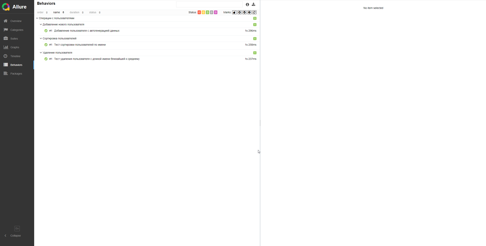

## Практикум SDET: задание UI

## Задание 1

### Проект автоматизированного тестирования UI на тестовой странице XYZ Bank. 

## 🏗️Структура проекта

| Компонент                    | Назначение                               |
|------------------------------|------------------------------------------|
| **📁 КОРНЕВЫЕ ФАЙЛЫ**        |                                          |
| `.gitignore`                 | 🚫 Исключения для Git                    |
| `requirements.txt`           | 📦 Зависимости Python                    |
| `conftest.py`                | ⚙️ Фикстуры Pytest                       |
| **📁 ДИРЕКТОРИИ ПРОЕКТА**    |                                          |
| **data/**                    | 📁 **Файлы с данными**                   |
| `data.py`                    | 🗃️ Тестовые данные                      |
| `urls.py`                    | 🌐 URL-адреса тестового окружения        |
| **data/**                    | 📁 **Файлы с вспомогательными методами** |
| `generators.py`              | 🛠️ Генерация данных                     |
| `helpers.py`                 | 🛠️ Вспомогательные методы               |
| **locators/**                | 📁 **Локаторы элементов**                |
| └─ `xyz_bank_locator.py`     | 🔎 Локаторы элементов XYZ Bank           |
| **pages/**                   | 📁 **Page Object модели**                |
| └─ `base_page.py`            | 🏗️ Базовый класс с общими методами      |
| └─ `xyz_bank_page.py`        | 🛠️ Методы работы с XYZ Bank             |
| **screenshots/**            | 📁 **Скриншоты тестов**          |
| **tests/**                   | 📁 **Тестовые сценарии**                 |
| └─ `test_add_customer.py`    | ✅ Тест добавления пользователя           |
| └─ `test_delete_customer.py` | ✅ Тест удаления пользователя             |
| └─ `test_sort_customers.py`  | ✅ Тест сортировки пользователей          |

## <h>Инструкция по запуску</h>

### Установить зависимости:

> pip install -r requirements.txt</h>

### Стандартный запуск (однопоточный):

> pytest --alluredir=allure_results

### Параллельный запуск (многопоточный):

> pytest tests/ -n auto --alluredir=allure-results

### Посмотреть отчет по прогону html:

> allure serve allure_results

## Пример отчета Allure

## 📋 Тест-кейсы для XYZ Bank

### ТК-1: Добавление пользователя

**Приоритет:**
- Высокий

**Предусловия:**
- Открыть браузер
- Переход на страницу https://www.globalsqa.com/angularJs-protractor/BankingProject/#/manager

**Шаги:**
1. Нажать на вкладку "Add Customer"
2. Сгенерировать "Post Code" из 10 цифр
3. Преобразовать "Post Code" в "First Name" по алгоритму
4. Заполнить поле "First Name" полученным значением после преобразования
5. Заполнить поле "Last Name" полученным значением после преобразования
6. Заполнить поле "Post Code" сгенерированным значением
7. Нажать кнопку "Add Customer"

**Ожидаемый результат:**
- Появляется алерт с текстом "Customer added successfully with customer id"
- Пользователь появляется в списке "Customers"

### ТК-2: Сортировка пользователей по имени

**Приоритет:**
- Высокий

**Предусловия:**
- Открыть браузер
- Переход на страницу https://www.globalsqa.com/angularJs-protractor/BankingProject/#/manager

**Шаги выполнения:**
1. Перейти на вкладку "Customers"
2. Нажать на заголовок столбца "First Name"
3. Получить список имен

**Ожидаемый результат:**
- Пользователи отсортировались в порядке возрастания по столбцу "First Name"

### ТК-3: Удаление пользователя с длиной имени ближайшей к среднему

**Приоритет:**
- Высокий

**Предусловия:**
- Открыть браузер
- Переход на страницу https://www.globalsqa.com/angularJs-protractor/BankingProject/#/manager

**Шаги выполнения:**
1. Получить список всех имен пользователей из таблицы
2. Вычислить длину каждого имени
3. Найти среднее арифметическое длин имен
4. Найти пользователя с длиной имени ближайшей к среднему
5. Удалить найденного клиента
6. Проверить, что пользователь удален из таблицы

**Ожидаемый результат:**
- Удаленный пользователь отсутствует в таблице